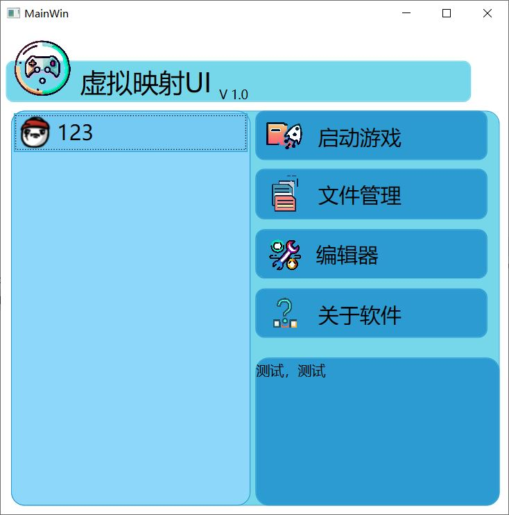
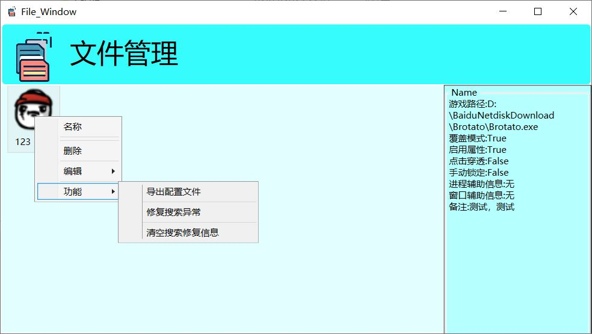
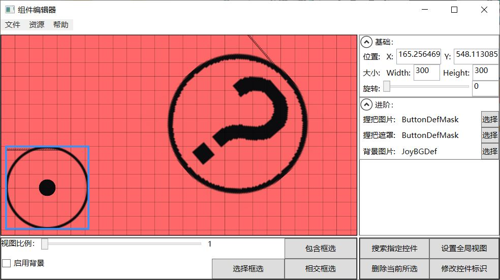
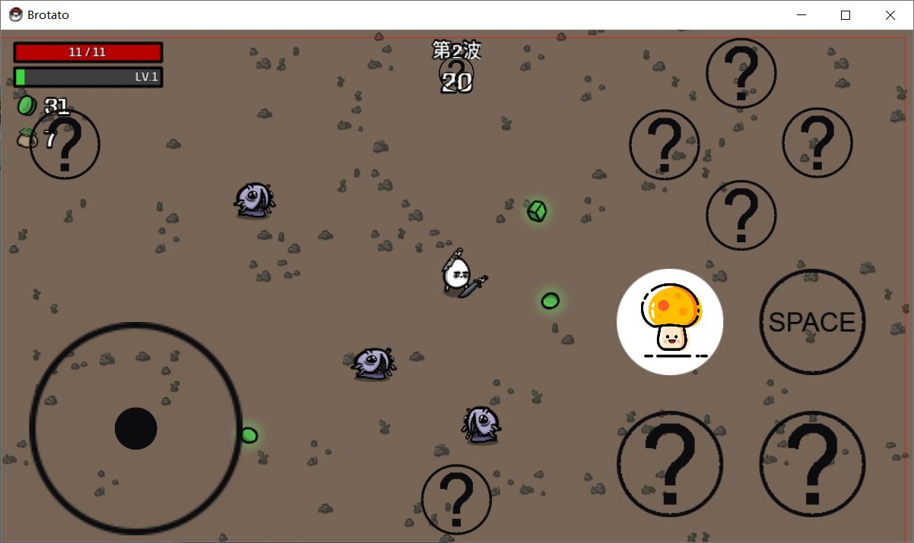

# TouchPad-Backend（WPF 版）说明文档

## 1. 项目简介

本项目是一个基于 C# 和 WPF 框架开发的**虚拟按键软件**。其主要目标是为 Windows 平台上的游戏或应用提供屏幕虚拟按键支持，通过覆盖 UI 层实现鼠标/键盘事件的模拟。项目包含以下核心模块：

- **虚拟按键功能**：在屏幕上添加自定义的虚拟按键，实现游戏或应用的辅助操作。
- **编辑器 UI**：用于设计和定制虚拟按键布局，以及配置按键属性。
- **管理界面 UI**：集中管理、启用/禁用、导入/导出虚拟按键方案。

> ⚠️ 由于 WPF的特性，自带的点击穿透功能对性能消耗较高。RMGUI对于动态的，变化频繁的UI可能会导致较大的内存占用和性能负担。种种原因该项目停止了，是个半成品，依然有很多bug与问题。

## 2. 功能演示

以下为软件主要界面及功能的演示图示意（请根据实际情况替换图片）：

| 总界面 UI | 管理界面 UI | 编辑界面 | 游戏界面  |
| :-: | :-: | :-: | :-: | 
|  |  |  |  |

## 3. 注意事项与项目备注

- **弃坑说明**：本项目由于 WPF 实现虚拟按键时存在性能瓶颈和较高内存开销，已正式弃用。
- **项目迁移**：相关功能已全部重构，迁移至 [@Xiaoer38324/TouchPad-Backend](https://github.com/Xiaoer38324/TouchPad-Backend) 项目中。
- **适配说明**：新项目为完全推翻重写，未对本项目进行适配或升级，代码结构与实现方式均有大幅更改。
- **适配说明**:新项目没有这个项目那么细的功能，并没有存档管理，修复，以及自动识别目标窗口状态等功能。新项目仅有UI管理模块。

---

> 本仓库仅作历史参考，推荐直接使用/贡献到新项目 [@Xiaoer38324/TouchPad-Backend](https://github.com/Xiaoer38324/TouchPad-Backend)。